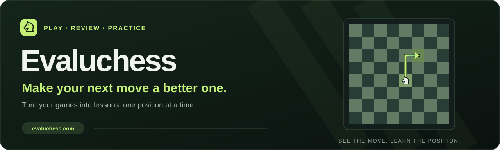

<p align="center">
  
</p>

# Evaluchess

A chess playground for getting better: play five-minute games, review every move with Stockfish, and practice your mistakes.

Evaluchess turns your own games into training material. Play against the computer or join an online match, examine where the position changed, and retry your mistakes before revealing the engine’s answer.

[Play Evaluchess](https://evaluchess.com) · [Player guide](docs/PLAYER-GUIDE.md) · [Developer guide](docs/DEVELOPMENT.md) · [Contribute](CONTRIBUTING.md)

## From a game to your next lesson

Three connected steps make each game useful:

| Step | What you do |
| --- | --- |
| Play | Choose White or Black against four computer difficulty levels, or use Speed Pair to find an online opponent |
| Review | Explore move classifications, accuracy, evaluation changes and the engine’s suggested alternatives |
| Practice | Retry mistakes on the board with the answer hidden, then follow the engine continuation |

Every new game uses **5+0**: five minutes per player, with no increment. Guests can start without an account. Speed Pair prioritizes humans; an available computer opponent can join after a 12-second wait.

## Built around your improvement

The board stays central during play, review and practice:

- **Feedback while you play**: live position evaluation, move classifications and comparison arrows
- **Review from your perspective**: your moves appear first; switch to your opponent’s moves when needed
- **Training from your games**: practice mistakes and blunders without seeing the answer first
- **Progress you can revisit**: saved games, accuracy trends and twelve activity or skill badges
- **Progress across devices**: signed-in accounts sync games, analysis, practice attempts and earned badges
- **Your preferred board**: themes, piece styles, promotion settings, premoves and optional sound
- **Portable game history**: export Portable Game Notation (PGN) files for use elsewhere
- **Responsive controls**: layouts down to 320 pixels, keyboard move review and reduced-motion support

Guests keep progress in this browser. Accounts retain the latest 50 saved games and preserve earned badges separately. Player preferences remain device-local.

## Run the app locally

Install Node.js 22 and npm, then start the browser app:

```sh
git clone https://github.com/ozanedge/evaluchess.git
cd evaluchess
npm ci
npm run dev
```

Open the local address printed by Vite. Computer play and browser-local progress use the client app; accounts and online play also require the API.

See the [developer guide](docs/DEVELOPMENT.md) for API configuration, isolated integration tests and deployment details.

## How the project fits together

Stockfish handles computer moves and analysis in a browser worker. The server owns online game state, clocks and ratings.

| Part | Technology |
| --- | --- |
| Interface | React 19, TypeScript, Vite and Tailwind CSS v4 |
| Chess rules | chess.js |
| Computer play and analysis | Stockfish 18, compiled to WebAssembly |
| Accounts, matches and progress | Vercel serverless functions and Amazon DynamoDB |
| Optional online opponents | A separate Node.js chess-computer worker |

Read the [architecture guide](docs/ARCHITECTURE.md) for game authority, storage and engine behavior.

## Explore the repository

Start with the guide for your task:

| Guide | Covers |
| --- | --- |
| [Player guide](docs/PLAYER-GUIDE.md) | Playing, reviewing, practice, badges, preferences and saved progress |
| [Developer guide](docs/DEVELOPMENT.md) | Local setup, commands and integration checks |
| [Architecture](docs/ARCHITECTURE.md) | Browser analysis, online game protocol and account storage |
| [Contributing](CONTRIBUTING.md) | Reporting problems and preparing changes |
| [Chess-computer worker](chesscomputers/README.md) | Optional background opponents and strength settings |
| [DynamoDB migration](docs/DYNAMODB-MIGRATION.md) | Infrastructure setup and storage cutover |

## Project credits

[Ozan Unlu](https://github.com/ozanedge) maintains Evaluchess. See [contributors](CONTRIBUTORS.md) for project acknowledgments.

Evaluchess uses [Stockfish](https://stockfishchess.org/) for chess analysis and [chess.js](https://github.com/jhlywa/chess.js) for chess rules. Computer difficulty labels are approximate targets; analysis and personal badges do not establish a player’s competitive rating.
